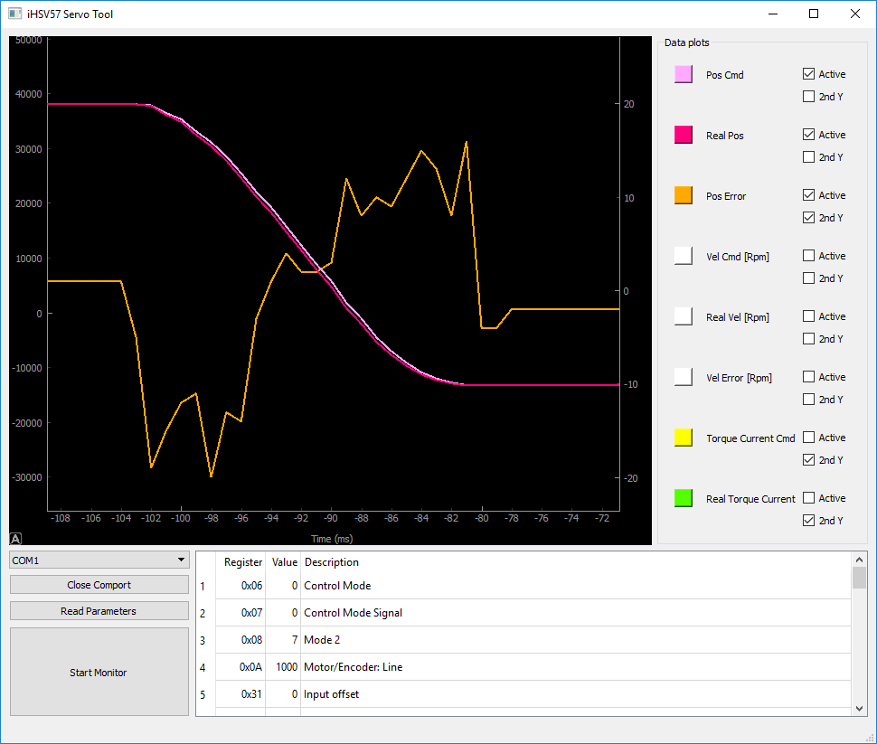

# iHSV-Servo-Tool

Python3-based tool to monitor and tune JMC iHSV servos.

## Prerequisites

You will need Python3, PyQt5, PyQtGraph, PySerial, Numpy and MinimalModbus.

### Linux

## DOES NOT WORK YET (no graphs are shown)
* sudo apt install python3 python3-pip python3-pyqt5 python3-pyqt5.qtserialport
* pip3 install setuptools pyqtgraph pyserial numpy minimalmodbus

### Windows

You may install [Anaconda Python Environment](https://conda.io/docs/user-guide/install/index.html "Anaconda Website") (Choose the Python3-flavour!).

After installing, you can install the other prerequisites using [conda](https://conda.io/docs/user-guide/tasks/manage-pkgs.html) and pip. Depending on your Anaconda-path, you will need to start the "Anaconda Prompt" with administrative privileges.
* conda install pyqt pyqtgraph pyserial numpy
* conda install -c auto minimalmodbus
* pip install minimalmodbus

After that, you should be able to run "iHSV Servo Tool" executing "python iHSV-Servo-Tool.py" in its directory.

## Operation

The program stores its window location, size, comport and the settings for each plot (its color, if it's active and the axis it scales with) when exited. Upon restart, all settings will be restored.

1. Start by selecting the comport connected to your JMC iHSV servo. (Remark: You will need TRUE RS232 levels, 3.3V logic level will NOT work!)
2. "Open Comport"
3. If you like, you can read all known parameters using "Read Parameters". They will be displayed in the lower right table.
4. You can ALTER each parameter by simply editing the table! Upon leaving the cell, the value will be AUTOMATICALLY written to the servo!
5. Start monitoring the data by clicking "Start Monitor". You can still ALTER parameters while monitoring the values!
6. Toy around with the graph!
    * Enable different plots setting them to "Active".
    * Change the color of each plot by clicking on the color picker button left of each plots name.
    * Assign a plot to the second y-axis by selecting "2nd Y".
    * Use your scrollwheel with the cursor in the plot area to zoom in and out both on timeline (x-axis) and first y-axis!
    * Zoom and move a specific axis (both y-axis independently, x-axis as well) by placing cursor over the axis and drag or scroll!
7. "Stop  Monitor" if you like to reset the graph.
8. "Close Comport" once you have a smile in your face because tuning was successfull.
9. Buy me a beer or start sending in pull requests!

## Remarks & Outlook

The tool is not finished, perfect or beautiful. But it works! Keep in mind that the program TRIES to maintain an update-rate of 100 Hz. The update-rate is affected both by system performance and - more likely - the bandwidth of the serial connection and the servos ability to handle the modbus-requests. I found out that it is possible to query multiple modbus-registers at once by using "read_registers" with higher lengths. Beside accelerating the data transfer, it also improves data quality by making reducing the time shift between the data points of various plots. For consecutive regs (say: "Pos Cmd" and "Read Pos") its trivial to aggregate, but I am looking for a strategy which might decide to even read unnecessary ("inactive") registers to a certain extend. Each plot already knows its corresponding registers, so the mapping is pretty trivial afterwards. Looking forward for pull-requests!
